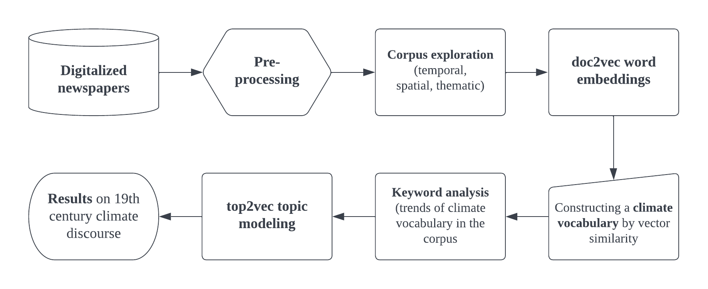

This is the repo of my ongoing master's project at the Ecole nationale des chartes (Paris). The aim is to detect descriptions of 19th century weather events in the Baltic countries from a digitized German-language newspaper, the Rigasche Zeitung. Interactive snippet overview of the corpus (a bit outdated): https://share.streamlit.io/krkryger/rigasche_zeitung_st/main/streamlit_rz.py

Workflow chart for M1 (first half of the project):

