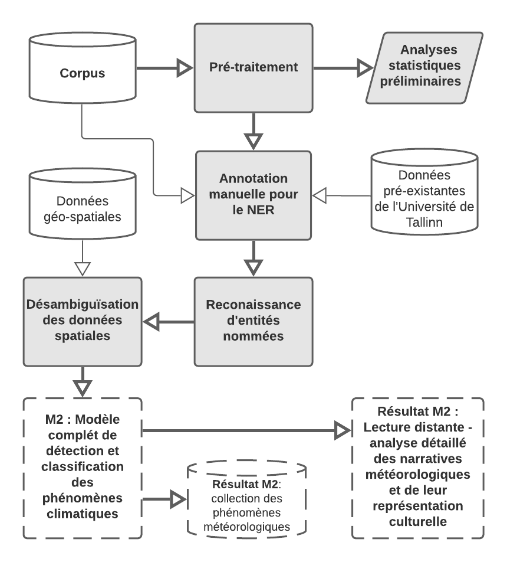

This is the repo of my ongoing master's project at the Ecole nationale des chartes (Paris). The aim is to detect 19th century weather events in the Baltic countries from a digitized collection of newspapers.

Workflow chart for M1 (first half of the project):

